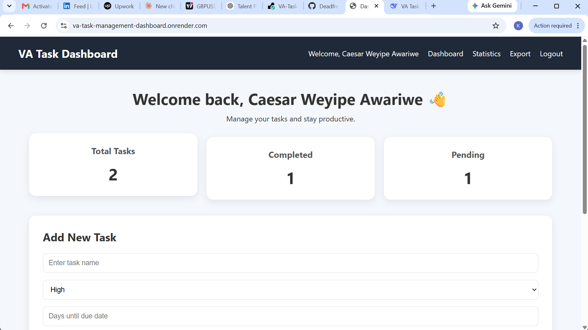
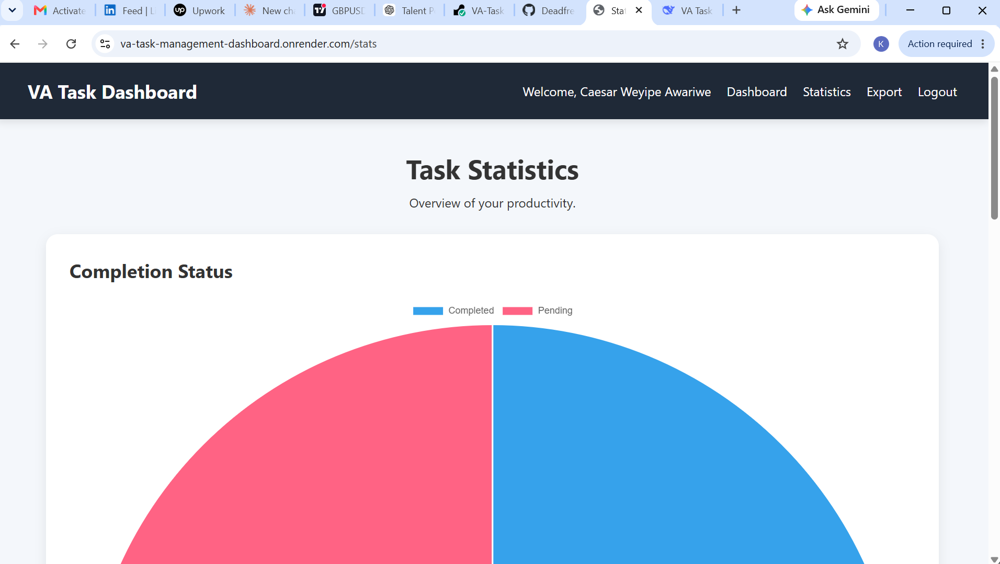
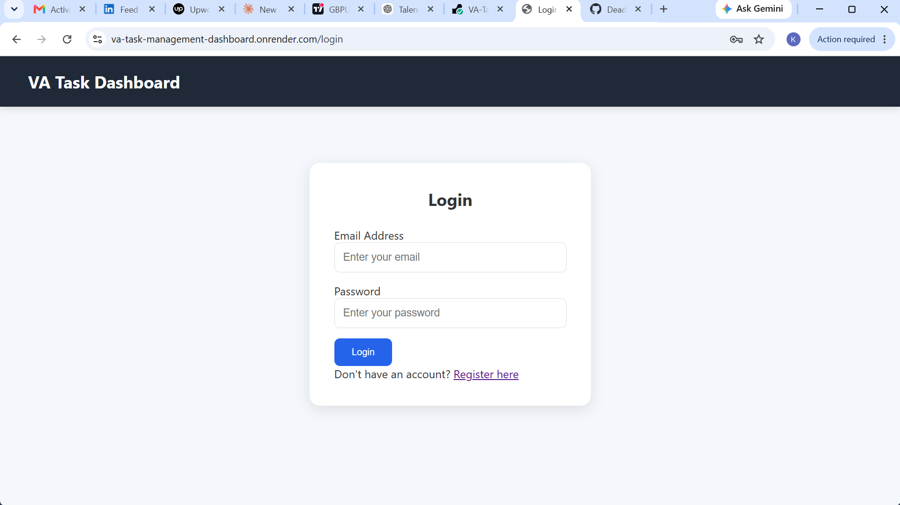

# VA Task Management Dashboard

A professional task management dashboard designed for Virtual Assistants to organize client tasks, track deadlines, monitor productivity, and manage daily workflows efficiently.

Built with Flask, this application demonstrates practical skills in web development, database management, authentication, task automation, and deployment.

## 🚀 Live Demo

https://va-task-management-dashboard.onrender.com/login

## 💡 Why I Built This

As I developed my skills as a Virtual Assistant, I realized that managing tasks, deadlines, and priorities efficiently is critical.

This project was built to simulate a real-world productivity tool that helps organize daily workflows, track performance, and improve efficiency using a clean and simple interface.

## 📌 Features

### 🔐 User Management
- User registration
- Secure login/logout
- Individual user dashboards

### ✅ Task Management
- Create tasks
- Edit tasks
- Delete tasks
- Mark tasks as completed
- Set task priorities
- Automatic due date calculation

### 📊 Dashboard
- Total task overview
- Completed and pending task statistics
- Clean and responsive dashboard interface

### 📈 Analytics
- Task completion charts
- Priority distribution charts
- Productivity tracking

### 📁 Export
- Export tasks into CSV format for reporting and record keeping

## 🛠️ Technologies Used

- Python
- Flask
- Flask-SQLAlchemy
- Flask-Login
- SQLite Database
- HTML5
- CSS3
- JavaScript
- Chart.js

## 📂 Project Structure
## 📸 Screenshots

### Dashboard

### Statistics

### Login

## 👨‍💻 Author

**Caesar Weyipe Awariwe**

Virtual Assistant | Data Entry Specialist | Flask Developer